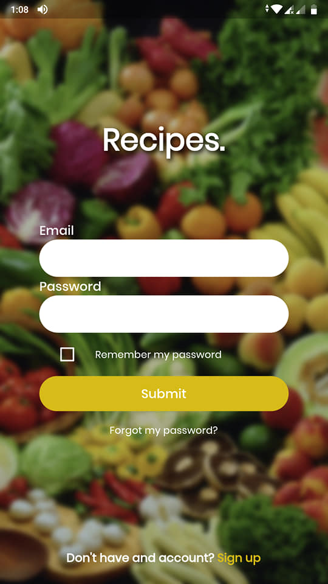
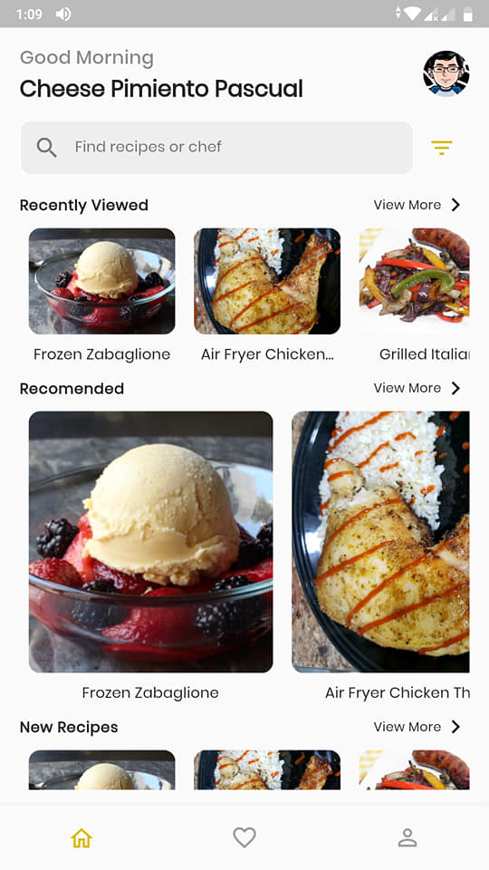
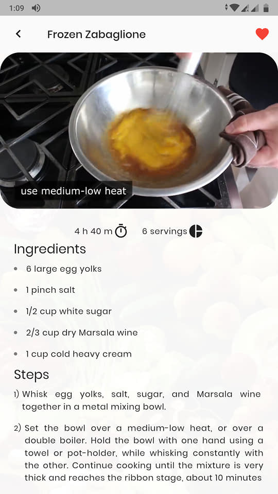
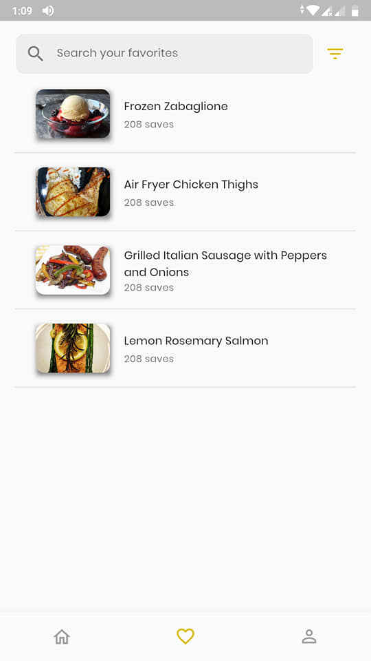

# recipe_app

This is to showcase what I am learning in Flutter. The UI design is from https://www.uplabs.com/posts/recipes-cooking-app-concept

## Core Features

- Pull to refresh / Infinite Lists
- Video Player

## App Screenshots

    <table>
        <tr>
            <td style="text-align: center">
                
            </td>            
            <td style="text-align: center">
                
            </td>
        </tr>
        <tr>
            <td style="text-align: center">
                
            </td>            
            <td style="text-align: center">
                
            </td>
        </tr>
    </table>

